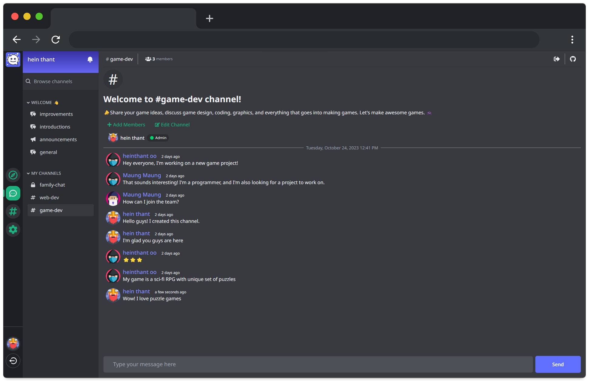

<details>
<summary>Table of Contents</summary>

- [Convoz](#convoz)
  - [🚀 Visit Live Website](#-visit-live-website)
  - [🔥 Features](#-features)
  - [🛠️ Stack](#️-stack)
  - [📙 Getting Started](#-getting-started)
  - [🗂️ Project Structure](#️-project-structure)
  - [🤝 Contributing](#-contributing)
  - [🎖️ Contributors](#️-contributors)
  - [📜 License](#-license)


</details>

# Convoz

[](https://github.com/IndieCoderMM/convoz-chat/commits/dev)
[](https://github.com/IndieCoderMM/convoz-chat/issues)
[](https://github.com/IndieCoderMM/convoz-chat/graphs/contributors)
[](https://github.com/IndieCoderMM/convoz-chat/stargazers)
[](https://github.com/IndieCoderMM/convoz-chat/blob/main/LICENSE)


> Open-source chat platform with discord-like features built with React, Redux, Vite and Firebase

## 🚀 Visit [Live Website](https://convoz-chat.onrender.com/)



## 🔥 Features

- **Real-time Chat**: Responsive chat experience with real-time updates
- **Channel Management**: Create, join and manage channels easily
- **User Authentication**: Secure user authentication with Google Sign-In
- **User-Friendly Interface**: Intuitive UI/UX design to enhance user experience

## 🛠️ Stack

This project was built using the following technologies:

- ⚛️ React
- 🔷 TypeScript
- 🔥 Firebase
- 🧰 Redux Toolkit
- ⚡ Vite
- 🔍 ESLint
- 🪝 react-firebase-hooks
- 🚦 react-router-dom
- 🎨 Tailwind CSS

## 📙 Getting Started

To get started with this project, follow these steps:

1. Clone the repository to your local machine.
2. Install the dependencies by running `npm install`.
3. Start the development server by running `npm start`.

## 🗂️ Project Structure

The project is structured as follows:

```
.
├── src/
│   ├── assets
│   ├── components
│   ├── features/
│   │   ├── Channels/
│   │   │   ├── CreateChannel.tsx
│   │   │   └── channelsSlice.ts
│   │   └── Chat
│   ├── lib/
│   │   ├── firebase.ts
│   │   └── store.ts
│   ├── pages/
│   │   ├── Landing.tsx
│   │   └── Channels.tsx
│   ├── styles
│   ├── App.tsx
│   ├── main.tsx
│   └── RootLayout.ts
├── package.json
└── tailwind.config.js
```

## 🤝 Contributing

This project is perfect for learners and open-source enthusiasts. We welcome contributions from everyone!

You can contribute in many ways:
- ⭐ Star the repo 
- 🐞 Report bugs
- 💡 Suggest new features
- 👩‍💻 Implement new features/bug fixes 

Please check out our [Contribution Guide](./CONTRIBUTING.md) for more details.

## 🎖️ Contributors

<!-- ALL-CONTRIBUTORS-LIST:START - Do not remove or modify this section -->
<!-- prettier-ignore-start -->
<!-- markdownlint-disable -->
<table>
  <tbody>
    <tr>
      <td align="center" valign="top" width="14.28%"><a href="https://heinthantoo.me/"><br /><sub><b>Hein Thant</b></sub></a><br /><a href="https://github.com/IndieCoderMM/convoz-chat/commits?author=IndieCoderMM" title="Code">💻</a> <a href="#design-IndieCoderMM" title="Design">🎨</a></td>
      <td align="center" valign="top" width="14.28%"><a href="https://github.com/PratyushJoshi"><br /><sub><b>Pratyush Joshi</b></sub></a><br /><a href="https://github.com/IndieCoderMM/convoz-chat/commits?author=PratyushJoshi" title="Code">💻</a></td>
    </tr>
  </tbody>
</table>

<!-- markdownlint-restore -->
<!-- prettier-ignore-end -->

<!-- ALL-CONTRIBUTORS-LIST:END -->

## 📜 License

This project is licensed under the MIT License - see the [LICENSE](./LICENSE) for details.
